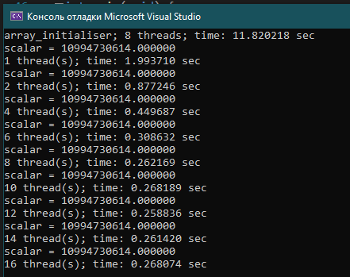
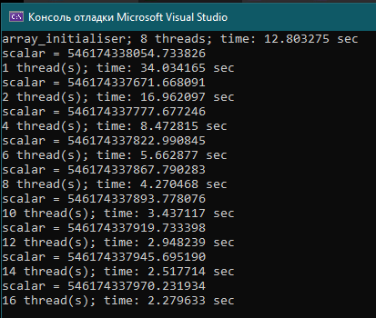
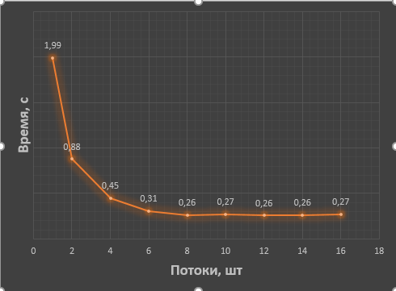

# ParallelComputingLab1
 
# Отчёт по лабораторной работе 1 по Параллельным вычислениям <br>студента группы ПА-18-2<br>Рябова Андрея Дмитриевича

## Инструкция
1. Напишіть програму на мові C для обчислення скалярного добутку двох векторів типу double. Розмір векторів виберіть таким чином, щоб вони займали половину оперативної памяті.
2. Модифікуйте даний алгоритм з допомогою прагм OpenMP і виконайте програму з використанням різної кількості нитей.
3. Обчисліть час виконання і проаналізуйте отримані результати.

## Выполнение:
**Source.c**
```
#include <stdio.h>
#include <stdlib.h>
#include <omp.h>
#include <time.h>
#include <math.h>

#define MY_ARRAY_LENGTH 536870912
#define MY_ARRAY_LENGTH_FOR_GIGABYTE 67108864
//#define ADDICTION_CALCULATION


double scalar(const double* a, const double* b) {
	double sum = 0;
	for (size_t i = (size_t)0; i < MY_ARRAY_LENGTH; i++) {
		sum += a[i] * b[i];
	}
	return sum;
}

double scalar_threads(const double* a, const double* b, const int threads) {
	double sum = 0;
	int i;
	#pragma omp parallel for shared(a, b) reduction (+: sum) private(i) num_threads(threads)
		for (i = 0; i < MY_ARRAY_LENGTH; i++) {
			#ifdef ADDICTION_CALCULATION
				sum += sqrt(sqrt(sqrt(a[i] * powf(b[i], 30))));
			#else
				sum += a[i] * b[i];
			#endif
		}
	return sum;
}

double* array_initialiser() {
	double* arr = (double*) malloc(MY_ARRAY_LENGTH * sizeof(double));
	if (!arr) {
		perror("malloc"); 
		exit(EXIT_FAILURE); 
	}
	int i;
	#pragma omp parallel for shared(arr) private(i) num_threads(8)
	for (i = 0; i < MY_ARRAY_LENGTH; i++) arr[i] = rand() % 10;
	return arr;
}

int main(void) {

	srand(time(NULL));

	double start = omp_get_wtime();
	double* a = array_initialiser();
	double* b = array_initialiser();
	printf("array_initialiser; 8 threads; time: %f sec\n", (omp_get_wtime() - start));

	for (size_t i = (size_t)1; i <= 16; i += 2) {
		start = omp_get_wtime();
		printf("scalar = %f\n", scalar_threads(a, b, i));
		printf("%zu thread(s); time: %f sec\n", i, (omp_get_wtime() - start));
		if (i == 1) i--;
	}

	free(a);
	free(b);
	return 0;
}
```
## Работа программы:
Использовалось 8ГБ оперативной памяти.



## График зависимости времени выполнения от потоков


## Вывод:
Если судить по результатам подсчётов времени, то можно сказать несколько вещей.   
Во-первых, при увеличении числа потоков с 1 до 8, скорость растёт примерно в 5-6 раз, так как процесс разпараллеливается на 8 различных потоков вместо одного. Конечно, есть потери при передаче информации между потоками, что и приводит к меньшим результатам в скорости.   
Во-вторых, скорость не растёт после количества потоков в 8 единиц. Это говорит о том, что на одном ядре находится 2 потока, которые не могут работать одновременно, что вызывает потери при переключении между потоками и никак не увеличивает скорость относительно выполнения программы на количестве потоков равных количеству ядер. Также я могу судить, хоть это и знаю, что у меня процессор имеет 8 ядер и 16 потоков.   
В-третьих, можно увидеть, что при использовании количества потоков с 9 до 16, мы получаем падение в скорости из-за потерь в передаче данных между потоками и забитого кэша 3 уровня.
Однако, если кэш не будет забит, то есть количество выполнимых операций для одного потока увеличить, то скорость всё же растет.
